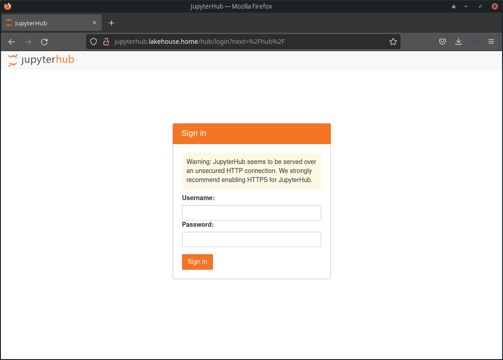
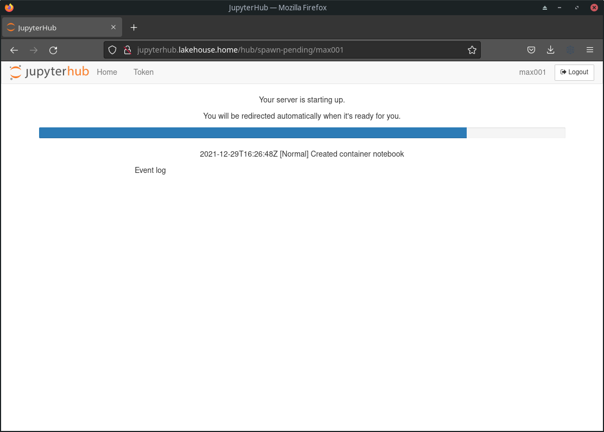
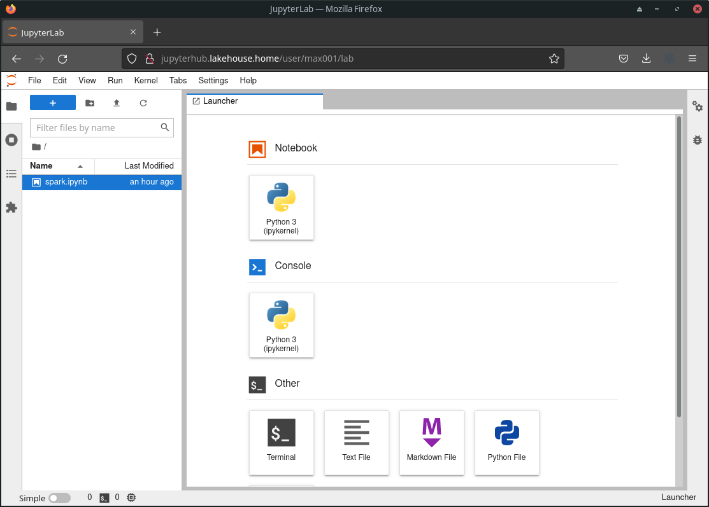

# Démarrer un JupyterLab dans le Lakehouse

Rendez vous sur l'url http://jupyterhub.lakehouse.home/



*JupyterHub n'est pas encore paramétré pour utiliser l'OpenID de Keycloak, c'est donc un mot de passe généric qui est utilisé.*

Aide : récupérer le mot de passe DummyAuthenticator de JupyterHub 
```bash
kubectl get secret/jupyterhub-hub -n jupyterhub -o 'go-template={{index .data "values.yaml" | base64decode | }}' | grep password
```

Après authentification, un serveur JupyterLab démarre.



Une fois le pod démarré on arrive sur l'interface du lab.



## Explication du workflow

- JupyterHub négocie avec Kubernetes pour démarrer un pod "jupyterhub-jupyter-{username}". Si la négociation est accepeté, un Pod avec l'image Docker [lakehouse-notebook](https://hub.docker.com/r/maximechartier/lakehouse-notebook) démarre. JupyterHub créer où réutilise un volume persistant dédié a l'utilisateur ce qui permet au Pod de sauvegarder les notebooks de l'utilisateur.

- Le Pod contact JupyterHub afin de s'authentifier et de s'enregister dans le "jupyterhub-proxy".

- L'utilisateur passe par ce proxy pour atteindre le port 8888  (Interface JupyterLab) du Pod qui lui est dédié.

- En même temps, ArgoEvent detecte la création de ce Pod et créer dans deux autres ressource dans Kubernetes, un Service et un VirtualService (Istio).

```
        +----------------+
        |                |
        |     Spark      |
        | Workers/Master |
        |                |
        +-------+--------+
                |
                v
        +----------------+              +--------------+
        |                | -----------> |              |
        |    Service     |   TCP/6060   |  JupyterLab  |
        |                |   TCP/4040   |     Pod      |
        |                |   TCP/2020   |              |
        +----------------+              +--------------+
                ^                              ^
                |HTTP/4040                     |HTTP/8888
        +-------+--------+              +------+-------+
        |                |              |              |
        | VirtualService |              | JupyterProxy |
        |     Istio      |              |     Pod      |
        |                |              |              |
        +----------------+              +--------------+
{username}.sparkui.lakehouse.home              ^
                                               |
                                        +------+--------+
                                        |               |
                                        | JupyterProxy  |
                                        |    Service    |
                                        |               |
                                        +---------------+
                                               ^
                                               |HTTP/80
                                       +-------+--------+
                                       |                |
                                       | VirtualService |
                                       |     Istio      |
                                       |                |
                                       +----------------+
                         jupyterhub.lakehouse.home/user/{username}/lab
```
*Les deux VirtualServices sont reliés à la passerelle Istio en charge du domaine **\*.lakehouse.home***

Voici le schéma de flux une fois le Pod JupyterLab créé.