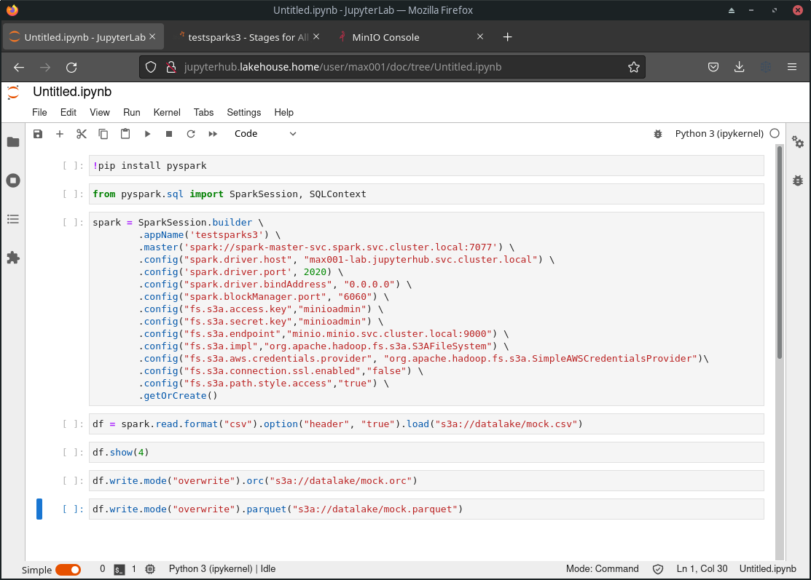

# Convertir un fichier CSV avec Spark

Après avoir démarré son JupyterLab.

Rendez vous sur l'url http://jupyterhub.lakehouse.home/user/max001/lab

Nous allons utiliser ce [notebook](assets/ex2_spark.ipynb) pour le test.

*L'accès au S3 est mal sécurisé mais ce n'est pas le but ici.*

JupyterLab :

L'interface utilisateur du driver Spark :

Vérification des fichiers créés dans le S3 :

